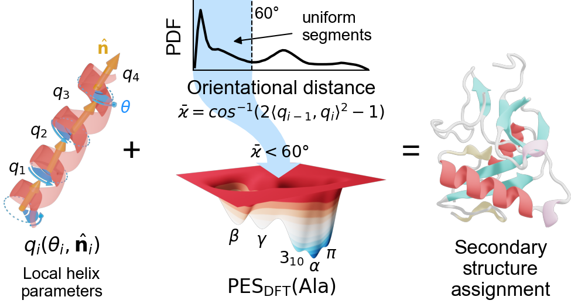
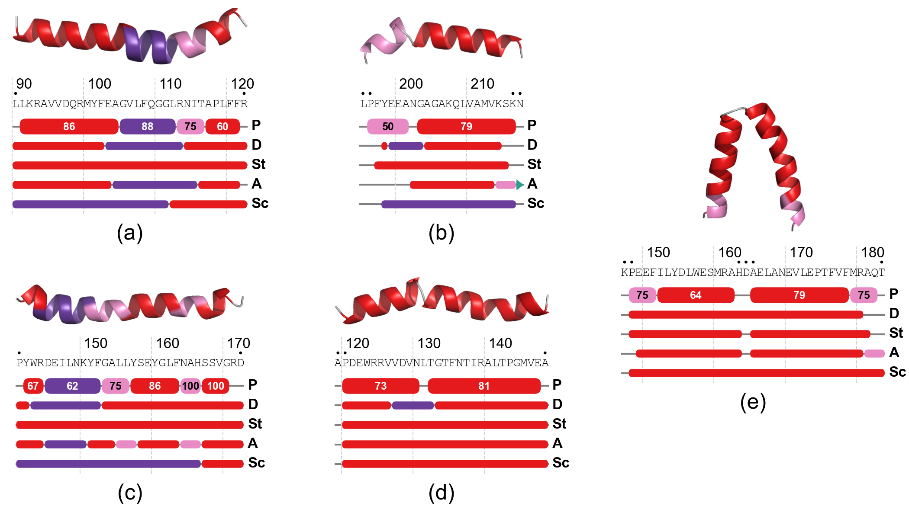
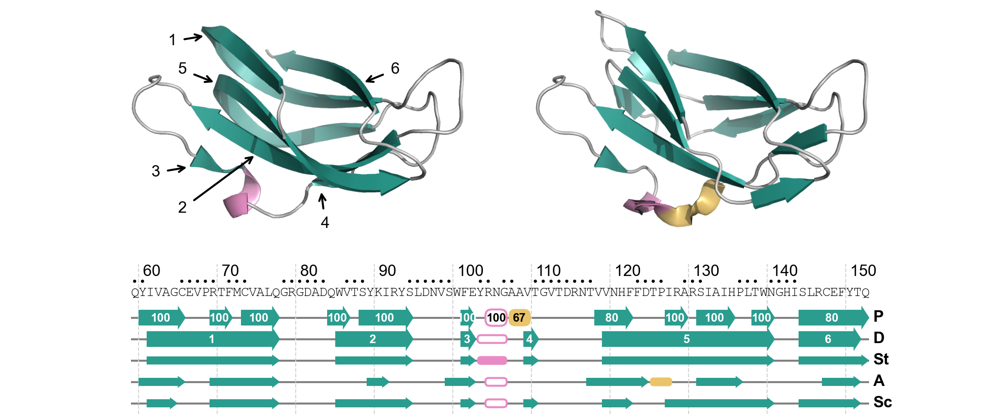

# PSIQUE: Protein Secondary structure Identification on the basis of QUaternions and Electronic structure calculations

PSIQUE is a geometry-based secondary structure assignment method that uses local helix parameters, quaternions, and a classification criterion derived from DFT calculations of polyalanine.
The algorithm can identify common (alpha-, 3₁₀-, π-helices and beta-strand) and rare (PP-II ribbon helix and γ-helices) secondary structures, including handedness when appropriate.

## Method



PSIQUE is based on the assumption that segments of amino acids with uniform (similar) geometry correspond to regular secondary structures, which can be determined from a Ramachandran-like map of polyalanine.
The latter is computed as the potential energy surface (PES) of polyalanine using density functional theory (DFT) for maximum accuracy, and it is expressed as a function of the local helix parameters pitch (L) and twist (θ) (instead of the traditional torsion angles φ and ψ).
The PES of polyalaline exhibits well-defined energy minima (or basins), each corresponding to a regular secondary structure, and so it is partitioned into distinct regions using the energy gradient.

The algorithm consists of four stages:

1. _Residue-wise secondary structure labeling_.
   Each residue is labelled by the secondary structure based on the closest basin to its (L,θ) values in the PES.
   β-sheets also require the presence of inter-strand backbone hydrogen bonds.
2. _Identification and extension of uniform stretches_.
   Protein structure uniformity is computed by a novel measure ϰ based on the distance between consecutive quaternions, which are 4D vectors that encode the orientation and rotation of each amino acid along the protein backbone.
   When ϰ < 60°, the segment is considered as uniform.
   Conversely, ϰ > 60° indicates that a residue has a geometry different from its neighbors, which is commonly observed in transition (e.g., helix subtypes) or unstructured regions (e.g., loops).
   Uniform segments are identified and assigned to the secondary structure label (step 1).
   These are then extended by reassigning adjacent nonuniform (unassigned) residues having similar (L,θ) values.
   The extension and reassignment deals with local distortions at the termini of the identified secondary structure segments.
3. _Reassignment of flanked nonuniform segments_.
   Unassigned residues flanked by helical or extended stretches are reassigned if the secondary structure is of the same class as their neighbors.
   Such a special case deals with local distortions produced by helix transitions or similar geometric changes.
4. _Normalization of regular segments_.
   Normalization ensures that the identified segments have a correct length and merges together short subsegments of the same class (e.g., consecutive helical elements).

PSIQUE was compared to standard (DSSP and STRIDE) and new (ASSP and SCOT) secondary structure assignment methods for both helical and extended segments.
PSIQUE shows good agreement (>85%) with other methods.
However, it provides better discrimination of subtle secondary structures (e.g., helix types) and termini, and produces more uniform segments while also accounting for local distortions.



PSIQUE agrees about 85% with other methods for right-handed helices, especially for α-helices.
Most discrepancies are at the helix termini.
Nevertheless, PSIQUE identifies helix subtypes and transitions correctly, whereas DSSP (D) and STRIDE (S) often report one single helix type for the same segments, especially STRIDE.
ASSP (A) and SCOT (Sc) fail to correctly identify the helix subtype besides α-helix.
Most methods also do not detect helix kinks (as seen in subfigure _e_).



PSIQUE agrees about 65% with other methods for β sheets, where the 82% of the
residue-wise discrepancies are due to low uniformity.
Indeed, hydrogen bond-based methods tend to produce highly-bent or twisted β sheets, but PSIQUE leaves such regions unassigned as the uniformity is very low (ϰ > 90°).

For further details, please refer to the [PSIQUE article](https://doi.org/10.1021/acs.jcim.0c01343).

## Installation

PSIQUE can be downloaded from the GitHub repository for Unix-like OS or built from the source code. _The former is recommended for most cases._

### Pre-built binaries

Binaries for either MacOS or Linux are available. Go to the webpage of the [latest release](https://github.com/franciscoadasme/chem.cr/releases/latest) and manually download and decompress the corresponding version, or use the command line as follows.

#### Linux

```sh
wget https://github.com/franciscoadasme/chem.cr/releases/latest/download/psique-linux.gz -O psique.gz && \
gzip -d psique.gz && \
chmod u+x psique
```

#### MacOS

```sh
curl -L https://github.com/franciscoadasme/chem.cr/releases/latest/download/psique-darwin.zip -o psique.zip && \
unzip psique.zip && \
chmod u+x psique
```

#### Windows

There is no version available for Windows as it is not supported by the Crystal language yet. It is recommended to use the Windows Subsystem for Linux (WSL) to run a local Linux distro within Windows and compile/run PSIQUE from it. For more information about WSL, refer to [WSL documentation](https://docs.microsoft.com/en-us/windows/wsl/about).

### From source

You need to install the crystal compiler by following [these steps](https://crystal-lang.org/install). Once it is installed, check the compiler by running:

```sh
$ crystal --version
Crystal 0.35.1 [5999ae29b] (2020-06-19)

LLVM: 8.0.0
Default target: x86_64-unknown-linux-gnu
```

Then, do the following:

```sh
tag=$(curl -s https://api.github.com/repos/franciscoadasme/psique/releases/latest | grep "tag_name" | cut -d\" -f4)
wget https://github.com/franciscoadasme/psique/archive/$tag.tar.gz -O psique-${tag#v}.tar.gz
tar xvf psique-${tag#v}.tar.gz
cd psique-${tag#v}
shards build --release --progress
```

The `psique` executable would be created at `bin/psique`. Check the compilation by:

```sh
$ ./bin/psique --version
PSIQUE 1.1.1 (2020-11-16)
```

## Usage

PSIQUE executable expects a PDB file containing a protein structure, and outputs a new PDB with the information of the protein secondary structure set in the header:

```sh
psique 1crn.pdb
```

By default, the output is written to standard output. Use the `-o/--output` to set an output file that will be created.

```sh
psique 1crn.pdb -o 1crn--psique.pdb
```

Note that special codes in the HELIX records in the PDB are used for structures not included in the standard format: 11 for left-handed 3₁₀-helix and 13 for left-handed π-helix.

Alternatively, the output can be written in other file formats that can be read by analysis and visualization packages via the `--format` option:

- `pymol` write a PyMOL Command Script (\*.pml) file that loads the protein, defines new colors for secondary structures, and sets the secondary structure according to PSIQUE. This file can be directly loaded into PyMOL from the Open menu.
- `stride` write a STRIDE output (\*.stride) file. This is useful to hook PSIQUE to any analysis and visualization software that expects a STRIDE file (see below).
- `vmd` write a VMD Command Script (\*.vmd) file that loads the protein, defines secondary structure colors, and sets the secondary structure according to PSIQUE.
  Note that it re-defines existing colors as VMD does not allow for custom colors.
  Also, it uses the "Secondary Structure" coloring method by changing the standard definitions.
  This file can be loaded by running `source script.vmd` from the Tcl/Tk Console within VMD or by executing VMD from the command line: `vmd -e script.vmd`.

For example, the following will write a PyMOL Command Script file instead of a PDB:

```sh
psique 1crn.pdb --format pymol -o 1crn.pml
```

Alternatively, the output format can be set via the `PSIQUE_FORMAT` environment variable:

```sh
PSIQUE_FORMAT=pymol psique 1crn.pdb -o 1crn.pml
```

This is useful for PSIQUE to mimic other software such as STRIDE (see [Hooking PSIQUE to other software](#hooking-psique-to-other-software)).

**Important** In both PyMOL and VMD Command Script files, the PDB file path is written as it is in the script file, so moving it into a different folder may break it.

### Hooking PSIQUE to other software

Analysis and visualization software like [ProDy](http://prody.csb.pitt.edu/), [VMD](https://www.ks.uiuc.edu/Research/vmd/), etc. can be tricked into using PSIQUE as long as they allow providing custom executables for STRIDE.

To do so, set the `PSIQUE_FORMAT` environment variable globally to the desired output format, and then simply set `psique` as the executable.

#### VMD

Visual Molecular Dynamics ([VMD](https://www.ks.uiuc.edu/Research/vmd/)) is a widely-used molecular visualization program for large biomolecular systems.
VMD uses the `STRIDE_BIN` environment variable to detect the STRIDE binary, so overwrite it to point to `psique`:

```sh
export PSIQUE_FORMAT=stride
STRIDE_BIN=/path/to/psique vmd
```

Note that VMD prints out a notice about the STRIDE citation each time it calls the STRIDE executable.
However, this does not tell which program was executed.

#### ProDy

[ProDy](http://prody.csb.pitt.edu/index.html) is a Python package for protein structural dynamics analysis.
It has functions to execute and parse STRIDE, but they do not support a custom path.
An alternative is to create a symbolic link named `stride` to `psique`.
For instance,

```sh
# place the symlink at a directory included in $PATH
ln -s /path/to/psique ~/bin/stride
export PSIQUE_FORMAT=stride
python -c 'import prody; ag = prody.performSTRIDE("/path/to/pdb"); print(ag.getSecstrs())'
```

#### Other

Please refer to the software documentation to check whether the STRIDE executable path can be set manually, and if so, follow the instructions given above.

## Citation

PSIQUE is research software, so please cite the corresponding article when using it in published work.

> Adasme-Carreño F., Caballero J., and Ireta J.; PSIQUE: Protein Secondary Structure Identification on the Basis of Quaternions and Electronic Structure Calculations. _J. Chem. Inf. Model._ **2021**, _61_, 4, 1789–1800. https://doi.org/10.1021/acs.jcim.0c01343

The BibTeX reference is:

```text
@article{adasme2021,
  title={PSIQUE: Protein Secondary Structure Identification on the Basis of Quaternions and Electronic Structure Calculations},
  author={Adasme-Carre{\~n}o, Francisco and Caballero, Julio and Ireta, Joel},
  journal={Journal of Chemical Information and Modeling},
  volume={61},
  number={4},
  pages={1789--1800},
  year={2021},
  publisher={ACS Publications}
}
```

## Development

The implementation of the PSIQUE method is developed under the [chem.cr](https://github.com/franciscoadasme/chem.cr) shard, so changes to the method itself are done at that repository.
This repository contains the PSIQUE standalone program.

## Contributing

1. Fork it (<https://github.com/franciscoadasme/psique/fork>)
2. Create your feature branch (`git checkout -b my-new-feature`)
3. Commit your changes (`git commit -am 'Add some feature'`)
4. Push to the branch (`git push origin my-new-feature`)
5. Create a new Pull Request

## Contributors

- [Francisco Adasme](https://github.com/franciscoadasme) ([fadasme@ucm.cl](mailto:fadasme@ucm.cl)) - creator and maintainer

## License

Licensed under the MIT license, see the separate LICENSE file.
